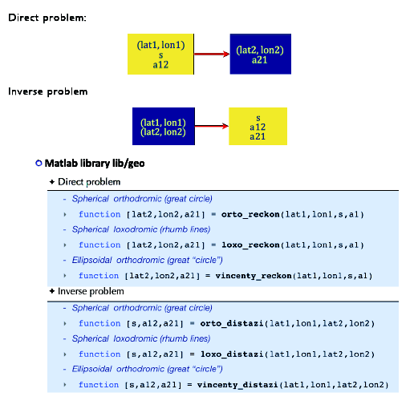
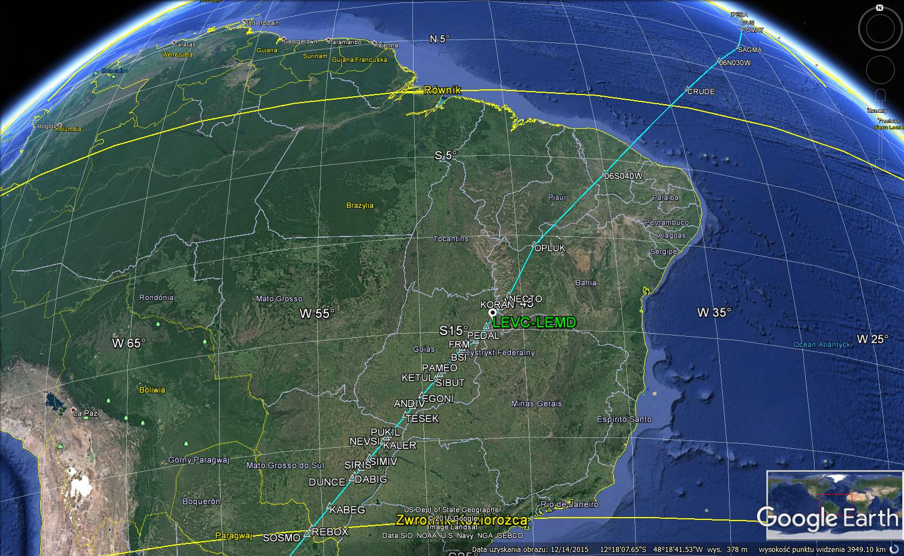
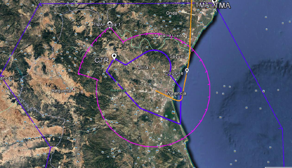
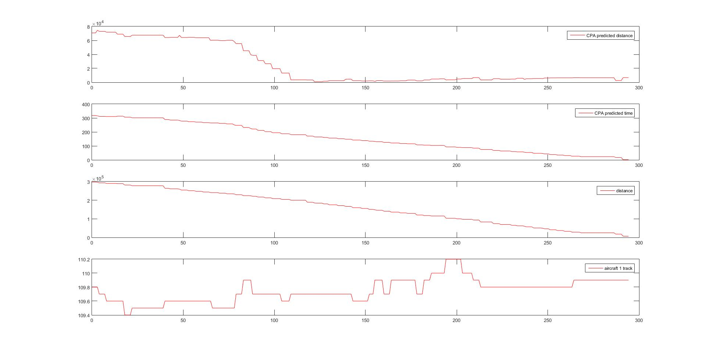
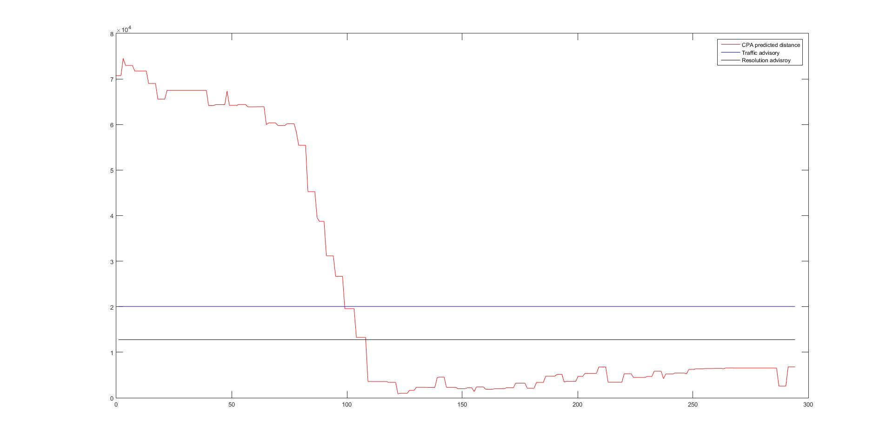

# Air_Transport_And_Navigation
Project realized in Matlab and Google Earth as a part of the course at Universitat Politecnica de Valencia.
The project consists of two exercises ("Tareas" in Spanish), which are described in separate pdfs.

Tarea1: 
Computation and representation of air routes making use of great circles, rhumb lines, and waypoint-defined routes between Spain, Valencia Airport and Santiago Airport in Chile.

Tech used: Matlab, Google Earth, KML library for generating KML files (used by Google Earth) in Matlab, Geo library with formulas for great-circles and rhumb-lines, flight plan of the route provided in xml.

Matlab files include time calculation and the wind effect analysis on time calculations, as well as visualisations and calculations of great circles, rhumb lines, and waypoint-defined routes: 

Tarea2: 
Using flightradar24.com and real life radar data to track data about flights arriving in Valencia, collect data about them and visualise them on Google Earth as well as Matlab diagrams showing various interesting flight charactersitics shuch as CPA - Closest Point of Approach (between two planes).

Flight stages:

Flight visualisation on Google Earth estimated from radar data:

Time evolution of CPA:

The second part of the Tarea2 project (Xplane-matlab-simulink) was a very basic autopilot written in Matlab able to communicate with Microsoft Xplane for controlling the altitude, heading, turn and Vpath.
